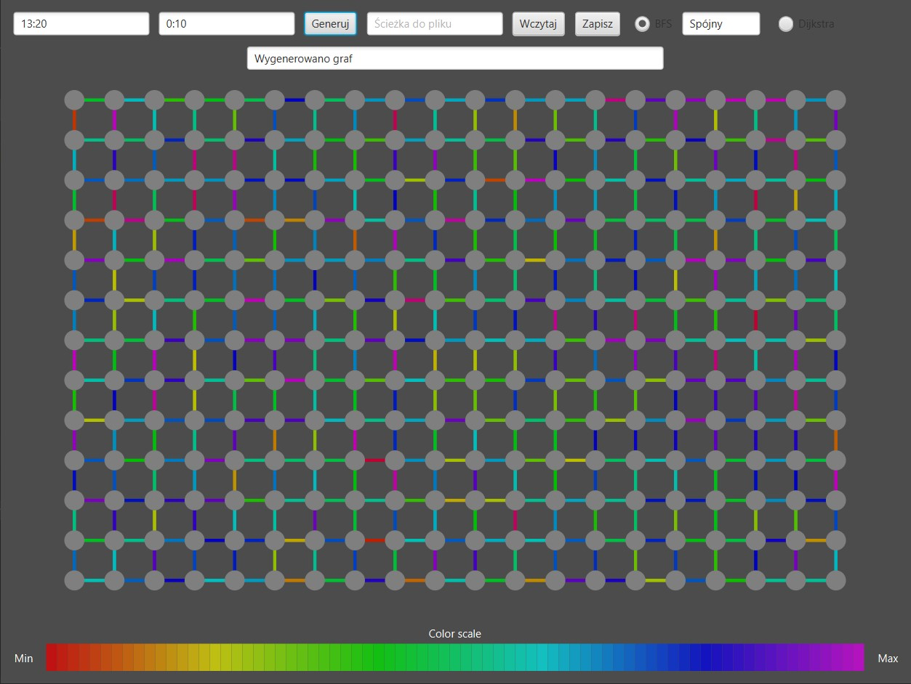
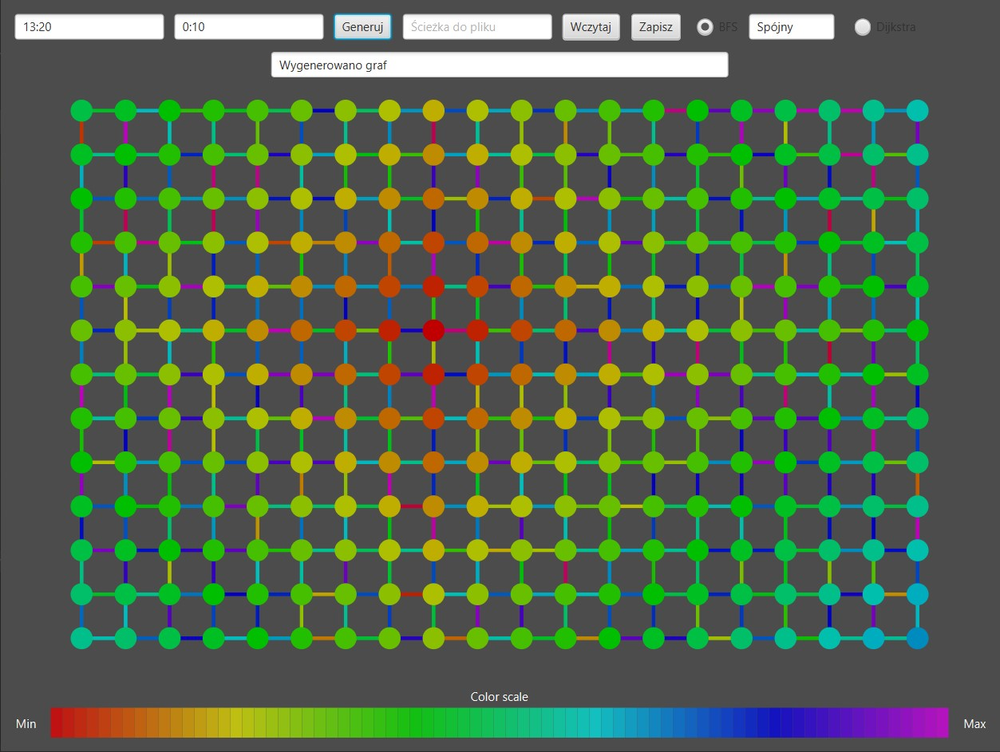
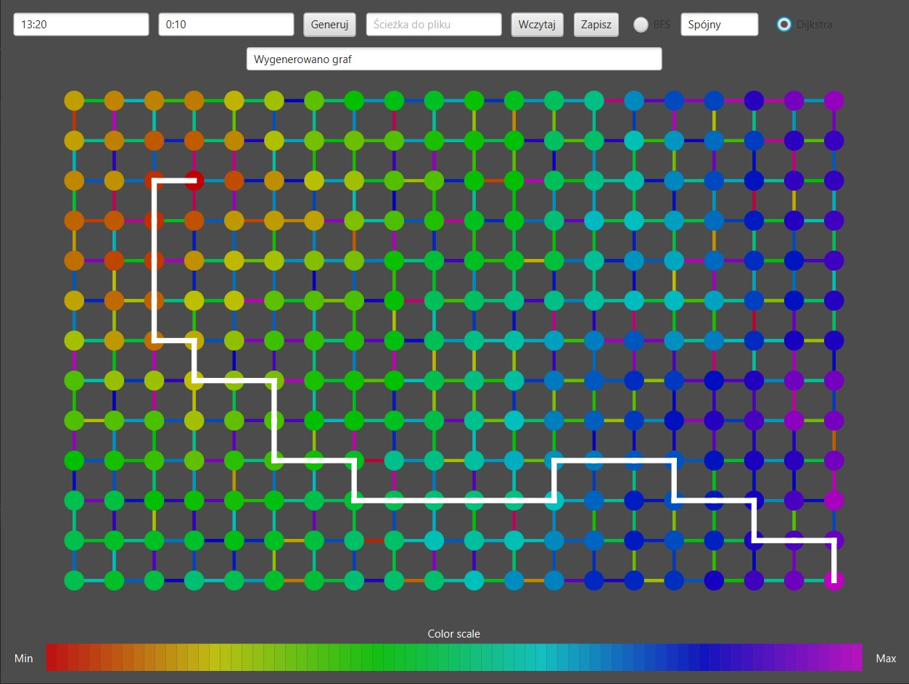
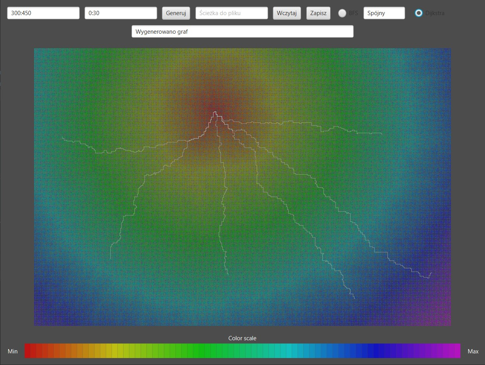

# GrafyJ
JavaFX Graph Generator

This project is a Java-based application using JavaFX. It can generate, read, and save directed, weighted graphs. Users can specify the range of weights for the graph edges.

The application includes two graph algorithms. The Breadth-First Search (BFS) is used to check graph connectivity. Dijkstra's Algorithm finds the shortest paths from a selected vertex to all other vertices and visualizes distances using a color scale. It also allows highlighting paths to specific vertices.

# Screenshots
<table>
  <tr>
    <td></td>
    <td></td>
  </tr>
  <tr>
    <td></td>
    <td></td>
  </tr>
</table>